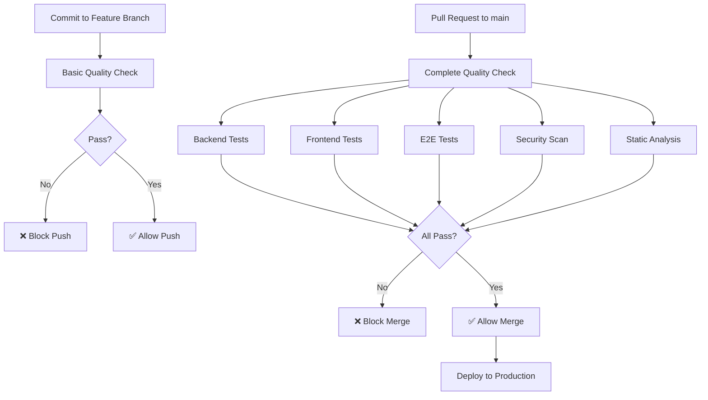

# 🚀 CI/CD Pipeline para Smashly App

Este documento describe la implementación completa del sistema de Integración Continua y Deployment Continuo (CI/CD) para la aplicación Smashly.

## 📋 Índice

- [🎯 Objetivos](#-objetivos)
- [🏗️ Arquitectura](#️-arquitectura)
- [⚙️ Configuración](#️-configuración)
- [🔄 Workflows](#-workflows)
- [🧪 Tests](#-tests)
- [🔒 Seguridad](#-seguridad)
- [📊 Monitoreo](#-monitoreo)
- [🚀 Deployment](#-deployment)

## 🎯 Objetivos

El sistema de CI/CD implementado cumple con los siguientes requisitos del TFG:

### ✅ Control de Calidad Básico

- Se ejecuta en cada commit a ramas de funcionalidad
- **Backend**: Compilación + Tests unitarios
- **Frontend**: Build + Tests unitarios
- **Lint**: Análisis estático básico

### ✅ Control de Calidad Completo

- Se ejecuta en Pull Requests a `main`
- **Backend**: Tests unitarios + integración + sistema
- **Frontend**: Tests unitarios + integración + sistema
- **E2E**: Tests de sistema multi-browser
- **Seguridad**: Análisis de vulnerabilidades
- **Calidad**: SonarQube + CodeQL

## 🏗️ Arquitectura



## ⚙️ Configuración

### 1. Secretos de GitHub

Configura estos secretos en `Settings` → `Secrets and variables` → `Actions`:

```bash
# Supabase
SUPABASE_URL=https://your-project.supabase.co
SUPABASE_SERVICE_ROLE_KEY=your-service-role-key
SUPABASE_ANON_KEY=your-anon-key

# JWT
JWT_SECRET=your-jwt-secret

# SonarQube (opcional)
SONAR_TOKEN=your-sonar-token
SONAR_HOST_URL=https://sonarcloud.io
```

### 2. Branch Protection Rules

Ejecuta el script para configurar automáticamente:

```bash
./.github/scripts/setup-branch-protection.sh
```

O configura manualmente en `Settings` → `Branches`:

- ✅ Require pull request reviews (1 approval)
- ✅ Require status checks to pass
- ✅ Require branches to be up to date
- ✅ Include administrators

## 🔄 Workflows

### 📋 [Basic Quality Check](.github/workflows/basic-quality-check.yml)

**Trigger**: Push a cualquier rama excepto `main`

**Jobs**:

- 🖥️ **Backend Basic**: Compilación TypeScript + Tests unitarios
- 🌐 **Frontend Basic**: Build Vite + Tests unitarios
- 🔍 **Lint Check**: ESLint backend + frontend
- 📋 **Summary**: Resumen de resultados

**Duración aproximada**: 3-5 minutos

### 🚀 [Complete Quality Check](.github/workflows/complete-quality-check.yml)

**Trigger**: Pull Request a `main`

**Jobs**:

- 🖥️ **Backend Complete**: Unit + Integration + Coverage (>70%)
- 🌐 **Frontend Complete**: Unit + Integration + Coverage (>70%)
- 🔍 **Static Analysis**: ESLint + SonarQube + CodeQL
- 🎭 **E2E Tests**: Multi-browser (Chrome + Firefox)
- 🔒 **Security Scan**: npm audit + CodeQL
- 📋 **Summary**: Resumen completo

**Duración aproximada**: 15-20 minutos

### 🌟 [Deploy Production](.github/workflows/deploy-production.yml)

**Trigger**: Merge a `main`

**Jobs**:

- 🔍 **Pre-deploy Validation**: Smoke tests
- 📦 **Build Artifacts**: Construcción para producción
- 🐳 **Docker Build**: Imágenes containerizadas
- ✅ **Post-deploy Verification**: Health checks

**Duración aproximada**: 8-12 minutos

## 🧪 Tests

### 🖥️ Backend (Node.js + TypeScript + Jest)

```bash
# Tests unitarios
npm run test:unit

# Tests de integración
npm run test:integration

# Coverage
npm run test:coverage
```

**Ubicación**: `backend/api/src/__tests__/`

- `unit/`: Tests con mocks (sin BD real)
- `integration/`: Tests con BD real
- `controllers/`: Tests de endpoints
- `services/`: Tests de lógica de negocio

### 🌐 Frontend (React + TypeScript + Vitest)

```bash
# Tests unitarios
npm run test:unit

# Tests de integración
npm run test:integration

# Coverage
npm run test:coverage
```

**Ubicación**: `frontend/src/__tests__/`

- `unit/`: Tests de componentes con mocks
- `integration/`: Tests de integración con API mock

### 🎭 E2E (Selenium WebDriver + Java + Maven)

```bash
# Chrome
mvn test -Dtest=E2ETestSuite -Dtest.browser=chrome

# Firefox
mvn test -Dtest=E2ETestSuite -Dtest.browser=firefox

# Headless
mvn test -Dtest=E2ETestSuite -Dtest.headless=true
```

**Ubicación**: `testing/src/test/java/com/smashly/e2e/`

## 🔒 Seguridad

### 🛡️ Análisis Estático

- **ESLint**: Análisis de código TypeScript/JavaScript
- **SonarQube**: Calidad de código, bugs, vulnerabilidades
- **CodeQL**: Análisis semántico de seguridad

### 🔍 Dependency Scanning

- **npm audit**: Vulnerabilidades en dependencias
- **GitHub Dependabot**: Actualizaciones automáticas de seguridad

### 🔐 Secrets Management

- Variables sensibles en GitHub Secrets
- No hardcodeo de credenciales
- Rotación periódica de tokens

## 📊 Monitoreo

### 📈 Métricas de Calidad

- **Cobertura de tests**: Mínimo 70%
- **Duración de builds**: Target <20min para complete check
- **Tasa de éxito**: Target >95%

### 📋 Reportes

- Coverage reports en artifacts
- Test results en formato JUnit
- Screenshots de E2E failures

### 🚨 Alertas

- Fallos de CI vía GitHub notifications
- Estado en badges del README
- Integration con Slack/Discord (opcional)

## 🚀 Deployment

### 🐳 Containerización

**Backend** (`backend/api/Dockerfile`):

- Base: `node:20-alpine`
- Multi-stage build
- Non-root user
- Health checks

**Frontend** (`frontend/Dockerfile`):

- Build: `node:20-alpine`
- Runtime: `nginx:alpine`
- Custom nginx config
- Security headers

### 🌍 Environments

- **Development**: Branches de funcionalidad
- **Staging**: Pull Requests (con E2E)
- **Production**: Rama main

### 📦 Artifacts

- Backend compiled (`dist/`)
- Frontend build (`dist/`)
- Docker images
- Test reports
- Coverage reports

## 🎯 Best Practices Implementadas

### ✅ Fail Fast

- Lint errors bloquean el pipeline
- Tests unitarios antes que integración
- Basic checks en cada commit

### ✅ Parallel Execution

- Jobs independientes en paralelo
- Matrix strategy para multi-browser
- Optimización de tiempos

### ✅ Idempotency

- Builds reproducibles
- Cache de dependencias
- Cleanup automático

### ✅ Security First

- Secrets en GitHub Secrets
- Analysis automático de vulnerabilidades
- Branch protection rules

### ✅ Observability

- Logs detallados
- Artifacts persistentes
- Status checks claros

## 🆘 Troubleshooting

### ❌ Common Issues

**1. Tests failing in CI but passing locally**

- Verificar variables de entorno
- Revisar timeouts en headless browser
- Comprobar diferencias de timezone

**2. E2E tests timing out**

- Aumentar timeouts en WebDriver config
- Verificar que servicios estén ready
- Revisar health check endpoints

**3. Coverage below threshold**

- Añadir tests para código no cubierto
- Revisar exclusions en jest/vitest config
- Verificar que tests se ejecutan correctamente

### 🔧 Debug Commands

```bash
# Debug backend locally
npm run test:unit -- --verbose

# Debug frontend locally
npm run test:coverage

# Debug E2E locally
mvn test -Dtest=E2ETestSuite -Dtest.headless=false

# Lint check
npm run lint
```

### 📞 Support

- 📚 [GitHub Actions Docs](https://docs.github.com/en/actions)
- 🐳 [Docker Best Practices](https://docs.docker.com/develop/dev-best-practices/)
- 🔬 [SonarQube Documentation](https://docs.sonarqube.org/)

---

## 🏆 Resumen de Implementación

✅ **Control de calidad básico** - Compilación y tests unitarios en cada commit  
✅ **Control de calidad completo** - Suite completa de tests en PR a main  
✅ **Análisis estático** - SonarQube, ESLint, CodeQL integrados  
✅ **Tests multi-nivel** - Unit, Integration, E2E, Security  
✅ **Multi-browser E2E** - Chrome y Firefox en paralelo  
✅ **Branch protection** - Merge bloqueado si fallan los checks  
✅ **Containerización** - Docker para deploy  
✅ **Seguridad** - Secrets management y vulnerability scanning

🎉 **¡Sistema CI/CD completamente funcional y listo para producción!**
