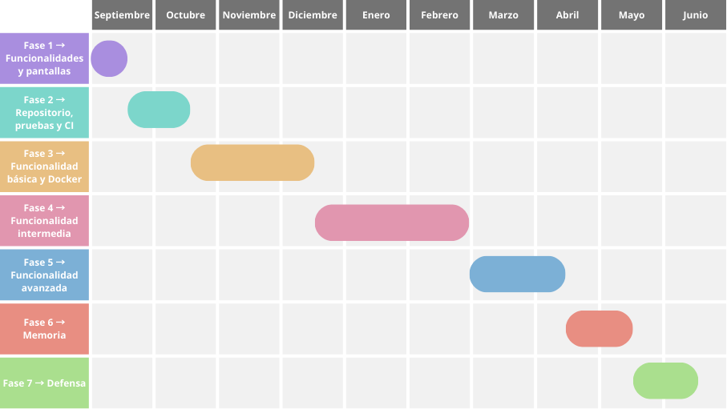
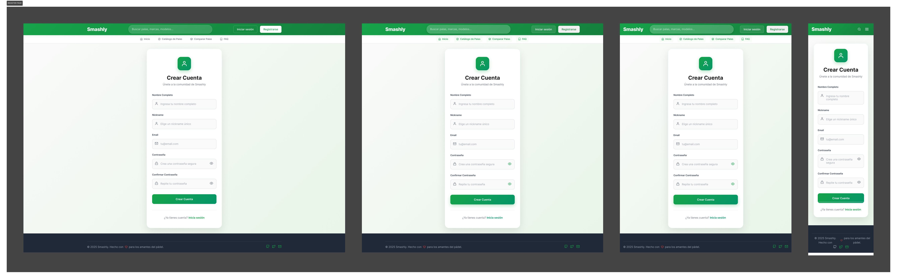
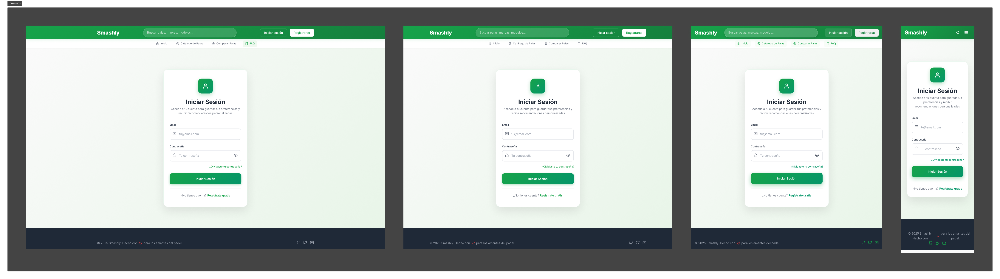
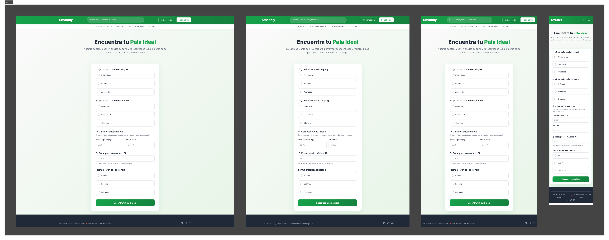
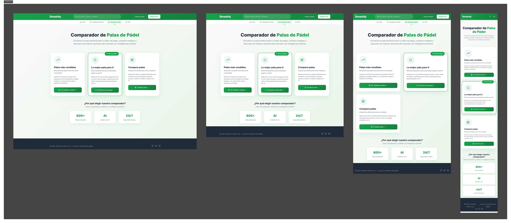
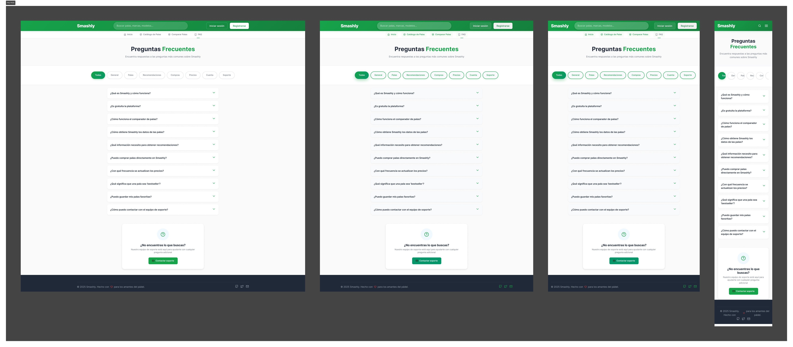

  

---

## 📋 Summary

🎾 This padel web application is designed for **amateur** and **semi-professional** players 🏆 looking to find the most suitable racket according to their characteristics and playing style.

The problem it solves is the **uncertainty when choosing a racket** ❓: many players buy the one used by a professional, even though it doesn't really adapt to their level or needs 🤔.

The application provides a **detailed catalog and intelligent comparator** 📊 that, based on user preferences and profile, recommends the most appropriate racket to improve their performance 📈 and avoid purchase decisions based solely on popularity ⭐.

---

## 🔢 Index
1. **🎯 [Objectives](#objectives)**
2. **📋 [Methodology](#methodology)**
3. **📅 [Planification](#planification)**
4. **⚙️ [Functionalities](#functionalities)**
5. **📊 [Analysis](#analysis)**
6. **🔄 [Tracking](#following)**
7. **👥 [Authors](#authors)**

---

## 🎯 Project Objectives

### ✅ Functional Objectives
- Provide a **detailed catalog of padel rackets** with technical specifications, images and prices.
- Allow users to **search, filter and compare** rackets from different brands and stores.
- Incorporate **personalized recommendations** based on user preferences.
- Manage **user authentication and profile**, including favorites and reviews.
- Synchronize and keep the catalog updated through **external store scrapers**.
- Provide additional support tools: **FAQ, informational pages and administration panel**.

### 🛠️ Technical Objectives
- Develop the **frontend in React with TypeScript**, structured in reusable components and managed with Vite.
- Implement the **backend in Node.js with Express**, following an architecture of controllers, services and middleware.
- Use **Supabase** as authentication and database service.
- Integrate **Python scrapers** to obtain and migrate data from external stores.
- Establish **RESTful API** communication between frontend and backend, with validation and security through middleware.
- Maintain a **scalable and maintainable** architecture, with clear separation of responsibilities.
- Document the API with **Postman Collection** and manage the project with **Git** for version control and collaboration.

---

## ⚙️ Methodology

The project is developed **iteratively**, in phases that guarantee continuous and clear progress.

| 🎯 Phase   | 📋 Description                              | ⏰ Deadline        | 🚀 Initial Date    | ✅ Final Date      |
| --------- | ------------------------------------------ | ----------------- | ----------------- | ----------------- |
| 📝 Phase 1 | **Functionality Definition and prototype** | 15 September 2025 | 10 September 2025 | 15 September 2025 |
| 🔧 Phase 2 | **Repository setup, testing and CI/CD**    | 15 October 2025   | -                 | -                 |
| 🐳 Phase 3 | **Basic functionality and Docker setup**   | 15 December 2025  | -                 | -                 |
| ⚡ Phase 4 | **Intermediate functionality**             | 1 March 2026      | -                 | -                 |
| 🚀 Phase 5 | **Advanced functionality**                 | 15 April 2026     | -                 | -                 |
| 📖 Phase 6 | **TFG Memory**                             | 15 May 2026       | -                 | -                 |
| 🎓 Phase 7 | **Final Presentation and Defense**         | 15 June 2026      | -                 | -                 |

---

## 📅 Project Planning and Schedule

### Gantt Diagram

The project's temporal management has been carefully planned following an agile methodology that ensures successful delivery of all functionalities. The following Gantt diagram shows the distribution of tasks, main milestones, and critical dependencies throughout the system development.

**🎯 Main Project Phases:**

- **📋 Phase 1: Analysis and Functionality Design**: Identification and categorization of main functionalities, user profile definition, and development of user interface prototypes.

- **🔧 Phase 2: Infrastructure and Testing**: Implementation of the application's base structure, test case development, and CI/CD pipeline configuration for automated deployment.

- **🐳 Phase 3: Core Development and Containerization**: Implementation of essential basic functionalities and application packaging through Docker to facilitate deployment in multiple environments.

- **🖥️ Phase 4: Intermediate Functionalities**: Development and integration of medium complexity features that enrich the user experience.

- **🤖 Phase 5: AI Integration and Advanced Functionalities**: Implementation of the recommendation system based on Gemini AI, RAG algorithms, and high technical complexity functionalities.

- **📚 Phase 6: Documentation and Technical Report**: Elaboration of complete project documentation, including technical report, user manual, and API documentation.

- **🎓 Phase 7: Presentation and Defense**: Preparation and presentation of the project before the evaluation tribunal, including practical demonstration of the developed system.

---

## ⚙️ System Functionalities

The functionalities are classified as **Basic**, **Intermediate** and **Advanced**, according to their level of complexity and priority.

### 🟢 Basic Functionalities
| Functionality                              | Unregistered User                             | Registered User                  | Administrator                         |
| ------------------------------------------ | --------------------------------------------- | -------------------------------- | ------------------------------------- |
| **Registration / Login**                   | Register, login, password recovery            | Manage their profile             | User management (roles, blocking)     |
| **View catalog**                           | Yes (read)                                    | Yes (read)                       | Yes (read + manage visibility)        |
| **View detail page**                       | Yes (read)                                    | Yes (read)                       | Yes (read + edit metadata)            |
| **Favorite rackets list with tags**        | —                                             | Yes (create/edit/delete own)     | View anonymized aggregates            |
| **User reviews on rackets**                | Read public reviews                           | Create/edit/delete own           | Moderation (approve, hide, ban)       |
| **Racket management**                       | —                                             | —                                | Add/edit/delete rackets               |
| **Store management**                        | —                                             | —                                | Add/edit/delete stores                |

### 🟡 Intermediate Functionalities
| Functionality                                          | Unregistered User             | Registered User                             | Administrator                          |
| ------------------------------------------------------ | ----------------------------- | ------------------------------------------- | -------------------------------------- |
| **Compare rackets**                                    | Basic comparison of 2 rackets | Complete comparison + save comparisons      | Define rules, sources and weights      |
| **View trending rackets**                              | Yes                           | Personalization based on activity          | Configure algorithm/triggers           |
| **Download comparison as PDF**                         | —                             | Their own comparisons                       | Global templates/branding              |
| **Price drop/rise alerts**                             | —                             | Subscription by racket/store/threshold     | Configure global thresholds and quotas |
| **Fill personal data for advanced form**               | —                             | Save game profile and preferences           | View anonymized aggregates             |
| **Advanced "best racket" form**                        | —                             | Advanced version with history               | Define questions, weights, A/B tests   |
| **Price history per racket (chart)**                   | Basic chart consultation      | Consult more details, export data          | Configure frequency and storage        |
| **Support / contact**                                  | Basic form                    | Ticket history                              | Support management                     |

### 🔴 Advanced Functionalities
| Functionality                                     | Unregistered User                           | Registered User                                               | Administrator                                  |
| ------------------------------------------------- | ------------------------------------------- | ------------------------------------------------------------- | ---------------------------------------------- |
| **Perform automatic price scraping**             | —                                           | —                                                             | Schedule/force executions, logs, retries      |
| **Recommend "Next racket" based on current one** | —                                           | Personalized recommendation                                   | Adjust models/rules                            |
| **Statistics panel**                              | —                                           | Consult their data (activity, favorites, comparisons)        | Global metrics, dashboards                     |
| **Notification system (in-app or email)**        | —                                           | Price alerts, reminders, news                                | Configure templates and policies               |
| **Best racket recommendation via AI**             | Basic form with general recommendations     | Advanced form with precise and personalized recommendations   | Configure form fields                          |

---

## 🔍 Initial Analysis

### 🖥️ User Interface - Application Walkthrough

#### 🏠 Main Page

The experience begins on our homepage, designed to offer direct access to Smashly's main functionalities.

From here, users can:

- **Access the AI recommendation system**
- **Explore the complete racket catalog**
- **Log in or register**
- **Check the FAQ**

#### 🔐 Authentication System

##### User Registration

##### Login

The authentication system allows users to create personalized profiles that improve AI recommendation accuracy.

#### 🤖 AI Recommendation Engine

**Form features:**

- **Complete profile analysis**: Playing level, style, physical characteristics
- **Technical preferences**: Racket shape, balance, materials
- **Customizable budget**
- **Instant recommendations** with detailed explanations

#### 🏪 Racket Catalog

**Catalog functionalities:**

- **+100 rackets** from the best brands
- **Advanced filters** by brand, level, shape, price
- **Price comparison** across multiple stores
- **Favorites and comparison system**

#### 🔍 Product Detail

**Detailed information:**

- **Complete technical specifications**
- **Multi-store price comparison**
- **Reviews and ratings**
- **Add to comparison button**
- **Related recommendations**

#### ⚖️ Comparison System

**Comparison features:**

- **Up to 3 rackets simultaneously**
- **Detailed AI analysis** of each option
- **Comparative specifications table**
- **Personalized final recommendation**
- **Pros and cons analysis**

#### ❓ Help Center

**Complete support:**

- **Frequently asked questions**
- **Usage guides**
- **Racket selection tips**
- **Technical information**

### 📦 System Entities

The main entities of the application are described below:

| Entity                                   | Description                                                                                                                                                                                               |
| ---------------------------------------- | --------------------------------------------------------------------------------------------------------------------------------------------------------------------------------------------------------- |
| 🏓 **Rackets**                           | Represent each padel racket available in the catalog. Include attributes like name, brand, model, image, technical characteristics (weight, balance, shape, materials, etc.) and associated prices.      |
| 👤 **Users**                             | Managed through the authentication system. Each user has a profile with personal data (name, email, avatar) and playing preferences (level, style, limitations, etc.).                                  |
| ✍️ **Reviews**                           | Opinions and ratings made by users about rackets. Include score, comments and reference to the user who created it.                                                                                      |
| 🤖 **Recommendations** *(under review)* | Allows users to get the racket that best suits their characteristics                                                                                                                                      |
| ✉️ **Newsletter Subscribers**            | Users who subscribe to receive updates, news and promotions. Stored with their email and subscription status.                                                                                            |

### 🖼️ Images
- **Racket images**: displayed in the catalog, detail page and comparison.
- **Graphic images/logos**: main application logo in the header and favicon.
  
### 📊 Charts
- **Minimum price evolution for each racket**: chart on the detail page to show price variation over time.

### 🧩 Complementary Technology
- **Email support**: contact channel for incidents or questions.
- **PDF generation**: possibility to download:
  - The detail page of a racket.
  - A comparison between selected rackets.
  - The result of the best racket recommendation according to AI.

### 🤖 Algorithms and Advanced Queries
1. **Next racket recommendation**: algorithm that suggests the best option based on current racket and user characteristics.  
2. **Minimum price calculation**: algorithm that determines the lowest price of each racket among various stores.  
3. **Advanced search**: search algorithm that goes through the entire database applying filters for characteristics, materials, weight, shape, etc.

---

## 📊 Project Tracking

  
  

---

## 👨‍🎓 Academic Information

**Final Degree Project** - **Software Engineering**

| Role                   | Name                    |
| ---------------------- | ----------------------- |
| **👨‍🎓 Student**          | Cristian Teijeiro Parga |
| **👨‍🏫 Academic Supervisor** | Michel Maes Bermejo     |

---

## 📄 License

Licensed under the Apache License, Version 2.0 (the "License");
you may not use this file except in compliance with the License.
You may obtain a copy of the License at

    http://www.apache.org/licenses/LICENSE-2.0

Unless required by applicable law or agreed to in writing, software
distributed under the License is distributed on an "AS IS" BASIS,
WITHOUT WARRANTIES OR CONDITIONS OF ANY KIND, either express or implied.
See the License for the specific language governing permissions and
limitations under the License.

