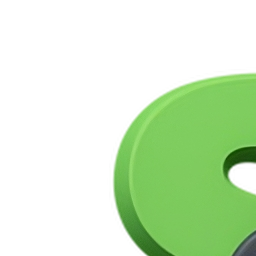

  

    <h1 style="
        font-size: 2.5rem; 
        font-weight: 800; 
        margin: 0;
        font-family: 'Arial Black', sans-serif;
    ">
      
        Smashly App - 
      
      
        Your game, your racket
      
    </h1>
  

  

    
  

---

## 📋 Summary

🎾 This padel web application is designed for **amateur** and **semi-professional** players 🏆 looking to find the most suitable racket according to their characteristics and playing style.

The problem it solves is the **uncertainty when choosing a racket** ❓: many players buy the one used by a professional, even though it doesn't really adapt to their level or needs 🤔.

The application provides a **detailed catalog and intelligent comparator** 📊 that, based on user preferences and profile, recommends the most appropriate racket to improve their performance 📈 and avoid purchase decisions based solely on popularity ⭐.

---

## 📗 Documentation
1. **🎯 [Objectives](docs/objectives.md)**
2. **📋 [Methodology](docs/methodology.md)**
3. **📅 [Planification](docs/planification.md)**
4. **⚙️ [Functionalities](docs/functionalities.md)**
5. **📊 [Analysis](docs/analysis.md)**
6. **🔄 [Following](docs/following.md)**
7. **👥 [Authors](docs/authors.md)**

---

## 📄 License

Licensed under the Apache License, Version 2.0 (the "License");
you may not use this file except in compliance with the License.
You may obtain a copy of the License at

    http://www.apache.org/licenses/LICENSE-2.0

Unless required by applicable law or agreed to in writing, software
distributed under the License is distributed on an "AS IS" BASIS,
WITHOUT WARRANTIES OR CONDITIONS OF ANY KIND, either express or implied.
See the License for the specific language governing permissions and
limitations under the License.

