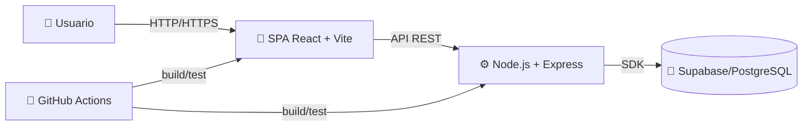

# 🚀 Guía de desarrollo (Smashly)

Esta guía describe cómo está construida, probada y desplegada la aplicación Smashly. Incluye un índice navegable, la arquitectura, tecnologías y herramientas, control de calidad, proceso de desarrollo y pasos para ejecutar y contribuir al proyecto.

## Índice

- [Introducción](#introducción)
- [Resumen técnico](#resumen-técnico)
- [Tecnologías](#tecnologías)
- [Herramientas](#herramientas)
- [Arquitectura](#arquitectura)
  - [Despliegue](#despliegue)
  - [API REST (OpenAPI)](#api-rest-openapi)
- [Control de calidad](#control-de-calidad)
  - [Tipos de pruebas y trazabilidad](#tipos-de-pruebas-y-trazabilidad)
  - [Ejecución y cobertura](#ejecución-y-cobertura)
  - [Análisis estático y métricas](#análisis-estático-y-métricas)
- [Proceso de desarrollo](#proceso-de-desarrollo)
- [Ejecución y edición de código](#ejecución-y-edición-de-código)
  - [Clonado y requisitos](#clonado-y-requisitos)
  - [Ejecución de servicios](#ejecución-de-servicios)
  - [Uso de herramientas (API, IDE, etc.)](#uso-de-herramientas-api-ide-etc)
  - [Ejecución de tests](#ejecución-de-tests)
  - [Creación de una release](#creación-de-una-release)

---

## Introducción

Smashly es una aplicación web con arquitectura SPA (Single Page Application). En una SPA el navegador descarga una página inicial y, a partir de ahí, la actualización de las vistas sucede en el cliente mediante JavaScript sin recargar la página completa. Esto mejora la experiencia de usuario y separa claramente presentación (frontend) y lógica de negocio (backend).

Partes del sistema:

- Cliente (frontend): React + Vite + TypeScript. Consume la API REST.
- Servidor (backend): Node.js + Express (TypeScript). Expone la API REST, aplica seguridad y accede a la base de datos.
- Base de datos: Supabase (PostgreSQL gestionado).

---

## Resumen técnico

- Tipo: Web SPA + API REST (cliente desacoplado).
- Tecnologías principales:
  - Frontend: React 18, Vite, TypeScript.
  - Backend: Node.js, Express, TypeScript, @supabase/supabase-js.
  - BD: Supabase (PostgreSQL gestionado).
- Herramientas de desarrollo: VS Code, npm, Maven (para E2E), Docker (local), Postman (API), SonarQube, GitHub Actions.
- Control de calidad:
  - Tests unitarios: Vitest (frontend), Jest (backend).
  - Tests de integración: Jest + Supertest (backend), Vitest (frontend integration).
  - Tests E2E/sistema: Java + Maven + Rest Assured (API) y Selenium WebDriver (UI).
  - Análisis estático: SonarQube; CodeQL; auditoría npm.
  - Cobertura: Jest/Vitest/JaCoCo.
- Despliegue:
  - Empaquetado: contenedores Docker (frontend estático, backend Node).
  - Orquestación local: docker-compose (opcional) o scripts npm.
  - Producción: contenedores (Docker Hub/GitHub Container Registry). Posible evolución a Kubernetes.
- Proceso de desarrollo: iterativo e incremental, Git Flow ligero, PRs, CI con GitHub Actions.

---

## Tecnologías

Se listan las tecnologías de ejecución (no herramientas de desarrollo):

- React (SPA): https://react.dev — UI declarativa en el navegador.
- Vite: https://vitejs.dev — bundler/dev-server rápido para TypeScript/React.
- TypeScript: https://www.typescriptlang.org — tipado estático en JS.
- Node.js: https://nodejs.org — runtime JS del backend.
- Express: https://expressjs.com — framework HTTP para Node.
- Supabase: https://supabase.com — plataforma sobre PostgreSQL; SDK para JS.
- Selenium WebDriver: https://www.selenium.dev — automatización UI para E2E.
- Rest Assured: https://rest-assured.io — test de APIs REST en Java.

Notas:

- El frontend consume la API REST del backend.
- El backend usa el SDK de Supabase para persistencia/autenticación.
- Las E2E UI requieren un navegador (Chrome/Firefox) y drivers (WebDriverManager).

---

## Herramientas

- VS Code: https://code.visualstudio.com — IDE principal.
- npm: https://www.npmjs.com — gestor de dependencias JS/TS.
- Maven: https://maven.apache.org — construcción de tests E2E en Java.
- Docker: https://www.docker.com — contenedores locales/CI/CD.
- Postman: https://www.postman.com — pruebas manuales de API.
- SonarQube: https://www.sonarsource.com/products/sonarqube/ — análisis estático.
- GitHub Actions: https://github.com/features/actions — CI/CD.
- CodeQL: https://codeql.github.com — análisis de seguridad.

---

## Arquitectura

### Despliegue

Componentes y canales de comunicación:

| Origen   | Destino  | Protocolo                 |
| -------- | -------- | ------------------------- |
| Frontend | Backend  | HTTP/HTTPS (API REST)     |
| Backend  | Supabase | PostgreSQL (SDK Supabase) |

Diagrama (alto nivel):



### API REST (OpenAPI)

- La API se documenta con Swagger/OpenAPI (en ejecución: `/api/docs`).
- Para visualizarla sin ejecutar la app, se debe incluir una versión HTML/JSON en el repo (por ejemplo `docs/api/index.html` y `docs/api/openapi.json`).
  - Pendiente: exportar la especificación OpenAPI del backend y añadirla a `docs/api/`.

---

## Control de calidad

### Tipos de pruebas y trazabilidad

- Frontend (Vitest + Testing Library):
  - Unit: `frontend/src/__tests__/unit/*` (p.ej. `App.test.tsx`).
  - Integration: `frontend/src/__tests__/integration/*`.
- Backend (Jest + Supertest):
  - Unit: `backend/api/src/__tests__/unit/*` (servicios con dobles/fixtures, p.ej. `racketService.simple.test.ts`).
  - Integration: `backend/api/src/__tests__/integration/*` (BD real / API real si procede).
- Sistema/E2E (Java + Maven):
  - API (Rest Assured): `testing/src/test/java/com/smashly/api/RestAssuredApiSystemTest.java`.
  - UI (Selenium): `testing/src/test/java/com/smashly/e2e/tests/FrontendSystemTest.java` y Page Objects en `.../pages`.

Trazabilidad funcional:

- Las funcionalidades están en `docs/functionalities.md`. Se recomienda añadir una columna “IDs de prueba” y en cada prueba referenciar el ID de funcionalidad correspondiente (p.ej., `F-API-01`, `F-UI-02`).

### Ejecución y cobertura

- Backend:
  - Unit: `cd backend/api; npm ci; npm run test:unit`
  - Integration: `npm run test:integration`
  - Cobertura: `npm run test:coverage` → `backend/api/coverage/`
- Frontend:
  - Unit: `cd frontend; npm ci; npm run test:unit`
  - Integration: `npm run test:integration`
  - Cobertura: `npm run test:coverage` → `frontend/coverage/`
- E2E (requiere backend y frontend arrancados):
  - API: `cd testing; mvn test -Dapi.url=http://localhost:3001`
  - UI: `cd testing; mvn test -Dfrontend.url=http://localhost:3000 -Dapi.url=http://localhost:3001 -Dtest.browser=chrome -Dtest.headless=true`

Cobertura mínima en CI: 70% (comprobada en workflows). Los informes (`lcov.info`, `coverage-summary.json`, JaCoCo) se suben como artefactos.

Capturas requeridas (añadir al repo en `docs/readme-images/` y enlazar aquí):

- [ ] Pantallazo ejecución tests backend.
- [ ] Pantallazo ejecución tests frontend.
- [ ] Pantallazo ejecución E2E (Selenium y/o Rest Assured).
- [ ] Resumen de cobertura (backend y frontend).

### Análisis estático y métricas

- SonarQube: workflow dedicado lanza análisis y Quality Gate.
- CodeQL: análisis de seguridad.
- Auditoría npm: `npm audit` en backend/frontend.

Métricas de tamaño de código (recomendado generar y añadir):

- Con `cloc` en raíz del repo (ejemplo):
  - Windows PowerShell:
    ```powershell
    cloc . --by-file --exclude-dir=node_modules,dist,coverage,target
    ```
- Añadir tabla con: Nº ficheros, LOC por tecnología (TS/JS/Java), Nº clases Java.

---

## Proceso de desarrollo

- Iterativo e incremental, principios ágiles (XP/Kanban). No se declara Scrum formal.
- Gestión de tareas: GitHub Issues + GitHub Projects (tablero Kanban).
- Git: repositorio mono-repo; ramas por feature (`feature/...`), fixes (`fix/...`), y PRs a `main`.
- Integración continua (GitHub Actions):
  - `basic-quality-check.yml` y `complete-quality-check.yml`:
    - Instalan deps, build, tests unit/integration, cobertura, análisis Sonar, E2E (matrix Chrome/Firefox), seguridad (npm audit, CodeQL), subida de artefactos.
    - Detalles relevantes vistos: Node 20, Java 11, umbral de cobertura 70%, artifacts de `coverage/` y `surefire-reports/`.
  - `deploy-production.yml`: pipeline de despliegue (contenedores).

---

## Ejecución y edición de código

### Clonado y requisitos

```powershell
git clone https://github.com/codeurjc-students/2025-Smashlyapp.git
cd 2025-Smashlyapp
```

Requisitos locales:

- Node.js >= 18 (el CI usa 20).
- Java 11+ y Maven (para E2E).
- Docker (opcional) para orquestación local.

### Ejecución de servicios

Backend (API):

```powershell
cd backend\api
npm ci
npm run build
$env:PORT='3001'; $env:NODE_ENV='development'
npm start
```

Frontend (SPA):

```powershell
cd frontend
npm ci
npm run build
npm run preview -- --port 3000
```

Base de datos (Supabase):

- Configurar variables: `SUPABASE_URL`, `SUPABASE_ANON_KEY`, `SUPABASE_SERVICE_ROLE_KEY` en el entorno del backend (o `.env`).
- Para tests de integración, usar credenciales de entorno de pruebas.

Acceso en local:

- SPA: http://localhost:3000
- API (health): http://localhost:3001/api/health
- API docs (en ejecución): http://localhost:3001/api/docs

### Uso de herramientas (API, IDE, etc.)

- VS Code: abrir la carpeta del repo y usar la integración con npm/Vitest/Jest.
- Postman: incluir colección en `docs/postman/smashly.postman_collection.json` (pendiente si no existe) con ejemplos para todos los endpoints:
  - GET `/api/health`, GET `/api/rackets`, GET `/api/rackets/{id}`, GET `/api/rackets/search`, etc.
  - Añadir ejemplos con parámetros (limit, q) y respuestas.

### Ejecución de tests

Backend:

```powershell
cd backend\api
npm run test:unit
npm run test:integration
npm run test:coverage
```

Frontend:

```powershell
cd frontend
npm run test:unit
npm run test:integration
npm run test:coverage
```

E2E (con servicios arriba):

```powershell
cd testing
mvn test -Dtest.browser=chrome -Dtest.headless=true -Dapi.url=http://localhost:3001 -Dfrontend.url=http://localhost:3000
```

### Creación de una release

1. Generar build de producción:

```powershell
cd frontend; npm run build
cd ..\backend\api; npm run build
```

2. Construir imágenes Docker (si aplica) y subir al registro.
3. Crear una release en GitHub con changelog, binarios (si procede) y referencias a artifacts.

---

## Notas y pendientes

- OpenAPI está accesible en ejecución (`/api/docs`). Pendiente exportarla a `docs/api/` para consulta sin levantar la app.
- Capturas de resultados (tests y Sonar) y tabla de métricas de código: pendientes de añadir.
- E2E en CI: el workflow debe levantar backend y frontend y pasar `-Dapi.url` y `-Dfrontend.url` a Maven para evitar fallos de conexión.

> Si alguna sección crece demasiado, puede extraerse a documentos independientes y enlazarse desde este índice.
