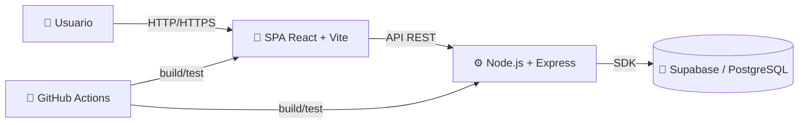
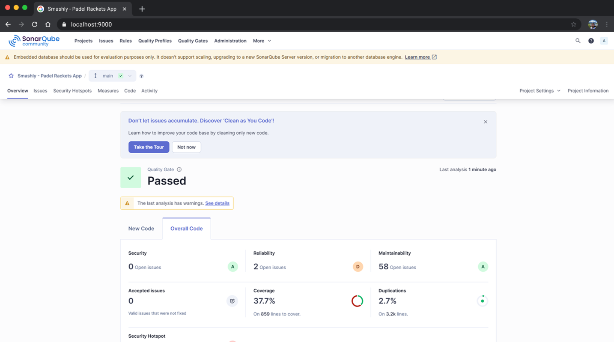

<div align="center">

# 🎾 **Smashly — Guía de Desarrollo**
</div>

---

## 🧭 **Índice**

- [🎾 **Smashly — Guía de Desarrollo**](#-smashly--guía-de-desarrollo)
  - [🧭 **Índice**](#-índice)
  - [💡 **Introducción**](#-introducción)
    - [🔧 Partes del sistema](#-partes-del-sistema)
  - [⚙️ **Resumen técnico**](#️-resumen-técnico)
  - [🧰 **Tecnologías**](#-tecnologías)
  - [🛠️ **Herramientas**](#️-herramientas)
  - [🏗️ **Arquitectura**](#️-arquitectura)
    - [☁️ **Despliegue**](#️-despliegue)
      - [🗺️ Diagrama (alto nivel)](#️-diagrama-alto-nivel)
    - [📜 **API REST (OpenAPI)**](#-api-rest-openapi)
  - [✅ **Control de calidad**](#-control-de-calidad)
    - [🧩 **Tipos de pruebas y trazabilidad**](#-tipos-de-pruebas-y-trazabilidad)
      - [🧱 Frontend (Vitest + Testing Library)](#-frontend-vitest--testing-library)
      - [⚙️ Backend (Jest + Supertest)](#️-backend-jest--supertest)
      - [🌐 Sistema / E2E (Java + Maven)](#-sistema--e2e-java--maven)
    - [📊 **Ejecución y cobertura**](#-ejecución-y-cobertura)
    - [🧮 **Análisis estático y métricas**](#-análisis-estático-y-métricas)
  - [🌀 **Proceso de desarrollo**](#-proceso-de-desarrollo)
  - [💻 **Ejecución y edición de código**](#-ejecución-y-edición-de-código)
    - [📂 **Clonado y requisitos**](#-clonado-y-requisitos)
    - [⚙️ **Ejecución de servicios**](#️-ejecución-de-servicios)
      - [🧩 Backend (API)](#-backend-api)
      - [🎨 Frontend (SPA)](#-frontend-spa)
      - [💾 Base de datos (Supabase)](#-base-de-datos-supabase)
    - [🧠 **Uso de herramientas (API, IDE, etc.)**](#-uso-de-herramientas-api-ide-etc)
    - [🧪 **Ejecución de tests**](#-ejecución-de-tests)
      - [🧱 Backend](#-backend)
      - [🎨 Frontend](#-frontend)
      - [🌐 E2E](#-e2e)
    - [🚢 **Creación de una release**](#-creación-de-una-release)

---

## 💡 **Introducción**

Smashly es una **aplicación web SPA (Single Page Application)** que separa la presentación (frontend) y la lógica de negocio (backend), ofreciendo una experiencia fluida sin recargas completas de página.

### 🔧 Partes del sistema
- **Frontend:** React + Vite + TypeScript — consume la API REST.
- **Backend:** Node.js + Express (TypeScript) — expone la API REST, aplica seguridad y gestiona la persistencia.
- **Base de datos:** Supabase (PostgreSQL gestionado).

---

## ⚙️ **Resumen técnico**

| Categoría                      | Descripción                                                     |
| ------------------------------ | --------------------------------------------------------------- |
| **Tipo**                       | Web SPA + API REST (cliente desacoplado)                        |
| **Frontend**                   | React 18, Vite, TypeScript                                      |
| **Backend**                    | Node.js, Express, TypeScript, @supabase/supabase-js             |
| **Base de datos**              | Supabase (PostgreSQL gestionado)                                |
| **Herramientas de desarrollo** | VS Code, npm, Maven, Docker, Postman, SonarQube, GitHub Actions |
| **Control de calidad**         | Vitest, Jest, Rest Assured, Selenium, SonarQube, CodeQL, JaCoCo |
| **Despliegue**                 | Docker (frontend/backend), GitHub Container Registry            |
| **Proceso**                    | Iterativo e incremental, Git Flow ligero, CI con GitHub Actions |

---

## 🧰 **Tecnologías**

- 🧩 **React:** [react.dev](https://react.dev) — UI declarativa y reactiva.
- ⚡ **Vite:** [vitejs.dev](https://vitejs.dev) — bundler rápido.
- 🟦 **TypeScript:** [typescriptlang.org](https://www.typescriptlang.org) — tipado estático.
- 🟩 **Node.js:** [nodejs.org](https://nodejs.org) — runtime JS.
- 🚏 **Express:** [expressjs.com](https://expressjs.com) — framework HTTP.
- 🗄️ **Supabase:** [supabase.com](https://supabase.com) — backend sobre PostgreSQL.
- 🧠 **Selenium WebDriver:** [selenium.dev](https://www.selenium.dev) — pruebas E2E UI.
- 🔍 **Rest Assured:** [rest-assured.io](https://rest-assured.io) — tests de APIs REST en Java.

> 💡 El frontend consume la API REST del backend, mientras que el backend utiliza el SDK de Supabase para persistencia y autenticación.

---

## 🛠️ **Herramientas**

| Herramienta          | Uso principal                     |
| -------------------- | --------------------------------- |
| 💻 **VS Code**        | IDE principal                     |
| 📦 **npm**            | Gestión de dependencias JS/TS     |
| ☕ **Maven**          | Tests E2E (Java)                  |
| 🐳 **Docker**         | Contenedores locales y CI/CD      |
| 🔬 **Postman**        | Pruebas manuales de API           |
| 🧩 **SonarQube**      | Análisis estático y métricas      |
| ⚙️ **GitHub Actions** | Integración y despliegue continuo |
| 🧱 **CodeQL**         | Análisis de seguridad             |

---

## 🏗️ **Arquitectura**

### ☁️ **Despliegue**

| Origen   | Destino  | Protocolo                 |
| -------- | -------- | ------------------------- |
| Frontend | Backend  | HTTP/HTTPS (API REST)     |
| Backend  | Supabase | PostgreSQL (SDK Supabase) |

#### 🗺️ Diagrama (alto nivel)



---

### 📜 **API REST (OpenAPI)**


📄 **Documentación disponible en:**
👉 [https://codeurjc-students.github.io/2025-Smashlyapp/](https://codeurjc-students.github.io/2025-Smashlyapp/)

---

## ✅ **Control de calidad**

### 🧩 **Tipos de pruebas y trazabilidad**

#### 🧱 Frontend (Vitest + Testing Library)

* Unit: `frontend/src/__tests__/unit/*`
* Integration: `frontend/src/__tests__/integration/*`

#### ⚙️ Backend (Jest + Supertest)

* Unit: `backend/api/src/__tests__/unit/*`
* Integration: `backend/api/src/__tests__/integration/*`

#### 🌐 Sistema / E2E (Java + Maven)

* API: `RestAssuredApiSystemTest.java`
* UI: `FrontendSystemTest.java`

> 📘 Trazabilidad funcional disponible en `docs/functionalities.md`

---

### 📊 **Ejecución y cobertura**

| Componente       | Comandos principales                             | Cobertura                      |
| ---------------- | ------------------------------------------------ | ------------------------------ |
| **Backend**      | `npm run test:unit` / `npm run test:integration` | `backend/api/coverage/`        |
| **Frontend**     | `npm run test:unit` / `npm run test:integration` | `frontend/coverage/`           |
| **E2E (API/UI)** | `mvn test -Dapi.url=...` / `-Dfrontend.url=...`  | Reports en `surefire-reports/` |

---

### 🧮 **Análisis estático y métricas**



---

## 🌀 **Proceso de desarrollo**

* 🔁 Iterativo e incremental, basado en principios ágiles (XP / Kanban).
* 📋 Gestión de tareas: *GitHub Issues + Projects (Kanban).*
* 🌿 Ramas: `feature/...`, `fix/...`, PRs hacia `main`.
* 🤖 **CI/CD (GitHub Actions):**

  * `basic-quality-check.yml` → compilación, tests, cobertura, Sonar.
  * `complete-quality-check.yml` → E2E (Chrome/Firefox), seguridad, CodeQL.
  * `deploy-production.yml` → despliegue con contenedores.

> 🎯 Cobertura mínima exigida: **70%**

---

## 💻 **Ejecución y edición de código**

### 📂 **Clonado y requisitos**

```bash
git clone https://github.com/codeurjc-students/2025-Smashlyapp.git
cd 2025-Smashlyapp
```

**Requisitos locales:**

* Node.js ≥ 18
* Java ≥ 11 + Maven
* Docker (opcional para orquestación local)

---

### ⚙️ **Ejecución de servicios**

#### 🧩 Backend (API)

```bash
cd backend/api
npm ci
npm run build
export PORT=3001 NODE_ENV=development
npm start
```

#### 🎨 Frontend (SPA)

```bash
cd frontend
npm ci
npm run build
npm run preview -- --port 3000
```

#### 💾 Base de datos (Supabase)

Configura las variables de entorno:

```
SUPABASE_URL=
SUPABASE_ANON_KEY=
SUPABASE_SERVICE_ROLE_KEY=
```

Accesos locales:

* 🌐 SPA → [http://localhost:3000](http://localhost:3000)
* ⚙️ API → [http://localhost:3001/api/health](http://localhost:3001/api/health)
* 📘 Docs → [http://localhost:3001/api/docs](http://localhost:3001/api/docs)

---

### 🧠 **Uso de herramientas (API, IDE, etc.)**

* **VS Code:** ejecutar scripts npm y tests desde el panel integrado.
* **Postman:** colección en `docs/postman/smashly.postman_collection.json` con endpoints de ejemplo (`/api/rackets`, `/api/health`, etc.).

---

### 🧪 **Ejecución de tests**

#### 🧱 Backend

```bash
cd backend/api
npm run test:unit
npm run test:integration
npm run test:coverage
```

#### 🎨 Frontend

```bash
cd frontend
npm run test:unit
npm run test:integration
npm run test:coverage
```

#### 🌐 E2E

```bash
cd testing
mvn test -Dtest.browser=chrome -Dtest.headless=true \
  -Dapi.url=http://localhost:3001 \
  -Dfrontend.url=http://localhost:3000
```

---

### 🚢 **Creación de una release**

1. **Generar build de producción**

   ```bash
   cd frontend && npm run build
   cd ../backend/api && npm run build
   ```
2. **Construir y subir imágenes Docker (si aplica)**
3. **Crear una release en GitHub**
   Incluyendo changelog, binarios y artifacts (`coverage/`, `reports/`).

---

<div align="center">

*Smashly © 2025 — Trabajo Fin de Grado*

</div>

