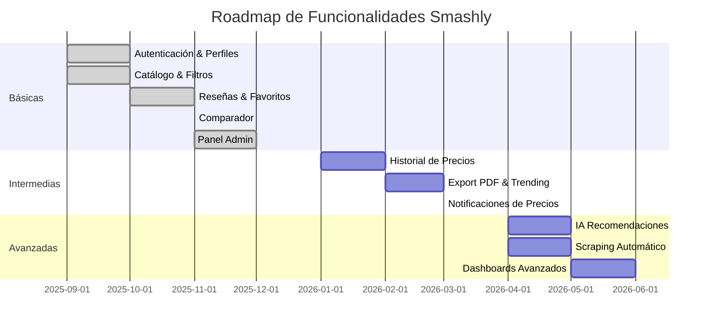

# ⚙️ Funcionalidades del Sistema

Las funcionalidades se clasifican en **Básicas**, **Intermedias** y **Avanzadas**, según el nivel de complejidad y prioridad.

**Estado de implementación:**

- ✅ **Implementado** - Funcionalidad completada en v0.1
- 🚧 **En desarrollo** - Funcionalidad parcialmente implementada
- ⏳ **Pendiente** - Funcionalidad planificada para próximas versiones

---

## 🟢 Funcionalidades Básicas

| Funcionalidad                              | Estado | Usuario no registrado                             | Usuario registrado               | Administrador                         |
| ------------------------------------------ | ------ | ------------------------------------------------- | -------------------------------- | ------------------------------------- |
| **Registro / Login**                       | ✅     | Registrarse, iniciar sesión ~~, recuperar contraseña (a la espera de implementarlo con envío de correo electrónico)~~ | Gestionar su perfil              | Gestión de usuarios (roles, bloqueo)  |
| **Ver catálogo**                           | ✅     | Sí (leer)                                         | Sí (leer)                        | Sí (leer + gestionar visibilidad)     |
| **Ver página detalle**                     | ✅     | Sí (leer)                                         | Sí (leer)                        | Sí (leer + editar metadatos)          |
| **Lista de palas favoritas con etiquetas** | ✅     | —                                                 | Sí (crear/editar/borrar propias) | Ver agregados anonimizados            |
| **Reseñas de usuarios sobre palas**        | ✅     | Leer reseñas públicas                             | Crear/editar/borrar propias      | Moderación (aprobar, ocultar, banear) |
| **Gestión de palas**                       | ✅     | —                                                 | —                                | Alta/edición/borrado de palas         |
| **Gestión de tiendas**                     | ✅     | —                                                 | —                                | Alta/edición/borrado de tiendas       |
| **Búsqueda global en tiempo real**         | ✅     | Sí (búsqueda instantánea)                         | Sí (búsqueda instantánea)        | Sí (búsqueda instantánea)             |
| **Registro dual (Jugador/Tienda)**         | ✅     | Registrarse como jugador o tienda                 | —                                | Aprobar solicitudes de tiendas        |
| **Sistema de manejo de errores**           | ✅     | Páginas de error personalizadas (404, 500, etc.)  | Sí                               | Sí                                    |
| **Modos de vista del catálogo**            | ✅     | Toggle grid/lista                                 | Toggle grid/lista                | Toggle grid/lista                     |
| **Filtros avanzados de catálogo**          | ✅     | Multi-marca, bestsellers, ofertas                 | Multi-marca, bestsellers, ofertas| Multi-marca, bestsellers, ofertas     |
| **Validación de contraseñas**              | ✅     | Display en tiempo real de requisitos              | —                                | —                                     |
| **Sistema de bloqueo de usuarios**         | ✅     | —                                                 | —                                | Ban/unban de usuarios                 |

**Notas de implementación v0.1:**

- ✅ **Registro/Login**: Sistema completo implementado con autenticación JWT. Incluye registro dual (jugador/tienda) con validación de contraseñas en tiempo real. La recuperación de contraseña está pendiente para v0.2.
- ✅ **Búsqueda global**: Componente de búsqueda en tiempo real con dropdown de resultados y navegación por teclado.
- ✅ **Catálogo**: Implementado con búsqueda, filtros avanzados (multi-marca, bestsellers, ofertas, forma, balance, precio), modos de vista (grid/lista) y paginación "Load More".
- ✅ **Página detalle**: Muestra información completa de cada pala, incluyendo características técnicas, precios por tienda, imágenes y reseñas.
- ✅ **Listas de favoritos**: Los usuarios pueden crear múltiples listas personalizadas, añadir/quitar palas desde el catálogo o detalle mediante modal, crear listas dentro del modal de añadir, y organizarlas con etiquetas.
- ✅ **Reseñas**: Sistema completo de valoraciones (1-5 estrellas) con comentarios, edición, likes/unlikes, filtrado por estrellas, ordenamiento (reciente, mejor/peor valorado, más likes), gráfico de distribución de ratings, y moderación por administradores.
- ✅ **Gestión de palas**: CRUD completo en panel de administración con formularios validados y gestión de imágenes.
- ✅ **Gestión de tiendas**: CRUD completo para administrar las tiendas asociadas a los precios de las palas. Incluye sistema de solicitudes de tiendas con aprobación por administrador.
- ✅ **Sistema de errores**: ErrorBoundary implementado con páginas de error personalizadas (404, 401, 403, 500) y manejo de errores en tiempo de ejecución.
- ✅ **Gestión de usuarios**: Panel de administración con listado de usuarios, ban/unban, cambio de roles, y búsqueda de usuarios.

---

## 🟡 Funcionalidades Intermedias

| Funcionalidad                                          | Estado | Usuario no registrado         | Usuario registrado                          | Administrador                          |
| ------------------------------------------------------ | ------ | ----------------------------- | ------------------------------------------- | -------------------------------------- |
| **Comparar palas**                                     | ✅     | Panel flotante hasta 3 palas  | Comparación completa + guardar comparativas | Definir reglas, fuentes y pesos        |
| **Ver palas *trending***                               | ⏳     | Sí                            | Personalización según actividad             | Configurar algoritmo/triggers          |
| **Descargar comparativa en PDF**                       | ⏳     | —                             | Sus propias comparativas                    | Plantillas/branding global             |
| **Avisos de bajada/subida de precios**                 | ⏳     | —                             | Suscripción por pala/tienda/umbral          | Configurar umbrales globales y cuotas  |
| **Rellenar datos personales para formulario avanzado** | ✅     | —                             | Guardar perfil de juego y preferencias      | Ver agregados anonimizados             |
| **Formulario "mejor pala" avanzado**                   | ⏳     | Formulario básico             | Versión avanzada con historial              | Definir preguntas, pesos, A/B tests    |
| **Historial de precios por pala (gráfico)**            | ⏳     | Consultar gráfico básico      | Consultar más detalles, exportar datos      | Configurar frecuencia y almacenamiento |
| **Soporte / contacto**                                 | ⏳     | Formulario básico             | Historial de tickets                        | Gestión de soporte                     |
| **Filtros y ordenamiento de reseñas**                  | ✅     | Ver reseñas filtradas         | Filtrar por estrellas y ordenar             | Filtrar por estrellas y ordenar        |
| **Sistema de likes en reseñas**                        | ✅     | —                             | Like/unlike reseñas                         | Like/unlike reseñas                    |
| **Gráfico de distribución de ratings**                 | ✅     | Ver distribución              | Ver distribución                            | Ver distribución + analytics           |
| **Perfil físico y de juego del usuario**               | ✅     | —                             | Peso, altura, nivel, limitaciones           | Ver datos agregados                    |

**Notas de implementación v0.1:**

- ✅ **Comparador de palas**: Implementado panel flotante de comparación que permite añadir hasta 3 palas. Sistema completo con prevención de duplicados y persistencia entre páginas mediante ComparisonContext.
- ✅ **Filtros y ordenamiento de reseñas**: Sistema completo con filtrado por número de estrellas (1-5) y ordenamiento por fecha (reciente), rating (alto/bajo) y número de likes. Implementado en ReviewFilters.tsx.
- ✅ **Sistema de likes**: Los usuarios registrados pueden dar like/unlike a reseñas de otros usuarios. Contador de likes visible en cada reseña.
- ✅ **Gráfico de distribución**: Visualización en barras horizontales mostrando la distribución porcentual de ratings (1-5 estrellas) en cada pala.
- ✅ **Perfil físico y de juego**: Usuarios pueden completar perfil con peso, altura, fecha de nacimiento (con cálculo automático de edad), nivel de juego (principiante/intermedio/avanzado/profesional), y observaciones sobre limitaciones físicas o estilo de juego.
- ⏳ **Formulario avanzado**: Implementado formulario básico de recomendación. La versión avanzada con IA y historial está en desarrollo.
- ⏳ **Palas trending**: Planificado para v0.2 con algoritmo basado en vistas, comparaciones y favoritos.
- ⏳ **PDF export**: Planificado para v0.2 con plantillas personalizables.
- ⏳ **Avisos de precios**: Planificado para v0.2 con sistema de notificaciones configurable.
- ⏳ **Historial de precios**: Planificado para v0.2 con gráficos interactivos y exportación de datos.
- ⏳ **Soporte**: Planificado sistema de tickets para v0.2.

---

## 🔴 Funcionalidades Avanzadas

| Funcionalidad                                     | Estado | Usuario no registrado                           | Usuario registrado                                                | Administrador                                  |
| ------------------------------------------------- | ------ | ----------------------------------------------- | ----------------------------------------------------------------- | ---------------------------------------------- |
| **Realizar scraping automático de precios**       | 🚧     | —                                               | —                                                                 | Programar/forzar ejecuciones, logs, reintentos |
| **Recomendar "Próxima pala" en base a la actual** | ⏳     | —                                               | Recomendación personalizada                                       | Ajustar modelos/reglas                         |
| **Panel de estadísticas**                         | ⏳     | —                                               | Consultar sus datos (actividad, favoritos, comparativas)          | Métricas globales, dashboards                  |
| **Sistema de notificaciones (in-app o email)**    | ⏳     | —                                               | Avisos de precios, recordatorios, novedades                       | Configurar plantillas y políticas              |
| **Recomendación de mejor pala mediante IA**       | ⏳     | Formulario básico con recomendaciones generales | Formulario avanzado con recomendaciones precisas y personalizadas | Configurar campos de formularios               |

**Notas de implementación v0.1:**

- ⏳ **Scraping automático**: Implementados scrapers en Python para 5 tiendas. La automatización con cron/scheduler está pendiente para v0.3.
- ⏳ **Panel de estadísticas**: Implementadas estadísticas básicas en panel de administración. Dashboards avanzados y gráficos interactivos planificados para v0.3.
- ⏳ **Recomendación con IA**: Implementado formulario básico con algoritmo de recomendación. Integración con Gemini AI para recomendaciones avanzadas en desarrollo para v0.3.
- ⏳ **Próxima pala**: Planificado para v0.3 con análisis de evolución de nivel y preferencias.
- ⏳ **Notificaciones**: Sistema completo de notificaciones push y email planificado para v0.3.

---

## 🎨 Funcionalidades Extras de UX/UI

Estas son funcionalidades adicionales implementadas que mejoran significativamente la experiencia de usuario pero no estaban contempladas en la documentación original:

| Funcionalidad                                  | Estado | Descripción                                                                                               | Ubicación                           |
| ---------------------------------------------- | ------ | --------------------------------------------------------------------------------------------------------- | ----------------------------------- |
| **Panel flotante de comparación**              | ✅     | Panel persistente mostrando palas seleccionadas para comparar (máx. 3), visible en todas las páginas     | ComparisonContext.tsx               |
| **Modal de añadir a listas desde catálogo**    | ✅     | Añadir palas a listas directamente desde el catálogo sin ir a la página de detalle                       | AddToListModal.tsx                  |
| **Crear lista dentro del modal de añadir**     | ✅     | Modal anidado que permite crear una nueva lista mientras se está añadiendo una pala                      | AddToListModal.tsx                  |
| **Toggle de vista en catálogo (Grid/Lista)**   | ✅     | Cambiar entre vista de cuadrícula y lista en el catálogo                                                 | CatalogPage.tsx                     |
| **Selección múltiple de marcas**               | ✅     | Filtrar por múltiples marcas simultáneamente en el catálogo                                              | CatalogPage.tsx                     |
| **Filtros rápidos de bestsellers y ofertas**   | ✅     | Botones de acceso rápido para filtrar por palas más vendidas y ofertas especiales                        | CatalogPage.tsx                     |
| **Búsqueda con dropdown en tiempo real**       | ✅     | Componente de búsqueda global con resultados instantáneos en dropdown, navegable por teclado             | GlobalSearch.tsx                    |
| **Validación visual de contraseña**            | ✅     | Muestra en tiempo real los requisitos de contraseña cumplidos (8+ chars, mayús, minús, número, especial)| RegisterPage.tsx                    |
| **Páginas de error personalizadas**            | ✅     | Páginas dedicadas para diferentes tipos de error (404, 401, 403, 500) con mensajes contextuales         | ErrorPage.tsx                       |
| **ErrorBoundary global**                       | ✅     | Componente que captura errores de React y previene crash completo de la aplicación                       | ErrorBoundary.tsx                   |
| **Registro dual con formularios específicos**  | ✅     | Formularios diferentes para registro de jugador vs. tienda con campos específicos para cada tipo         | RegisterPage.tsx                    |
| **Modal de confirmación para tiendas**         | ✅     | Muestra estado pendiente y próximos pasos tras registro de tienda                                        | StoreRequestModal.tsx               |
| **Sistema de badges visuales**                 | ✅     | Badges de "Bestseller" y "Oferta" con descuento porcentual en las tarjetas de palas                     | RacketDetailPage.tsx, CatalogPage   |
| **Cálculo automático de edad**                 | ✅     | Calcula automáticamente la edad del usuario basado en fecha de nacimiento                                | UserProfilePage.tsx                 |
| **Contador de palas por lista**                | ✅     | Muestra el número de palas en cada lista en las tarjetas de listas                                      | MyListsSection.tsx                  |
| **Promedio de rating con visualización**       | ✅     | Muestra promedio de estrellas con valor numérico y total de reseñas                                      | RacketReviews.tsx                   |
| **Paginación "Load More"**                     | ✅     | Botón para cargar más palas en lugar de paginación tradicional                                           | CatalogPage.tsx                     |
| **Loading states globales**                    | ✅     | Estados de carga consistentes en toda la aplicación durante operaciones asíncronas                       | Todos los contextos                 |
| **Timestamps relativos en reseñas**            | ✅     | Muestra "hace X tiempo" en lugar de fecha exacta para mejor UX                                           | ReviewItem.tsx                      |
| **Protección de rutas con roles**              | ✅     | Sistema robusto de protección de rutas que verifica autenticación y rol de administrador                 | ProtectedRoute.tsx                  |

**Notas adicionales:**

- 🎯 **UX coherente**: Todas las funcionalidades mantienen un diseño consistente con toast notifications para feedback de usuario.
- 🔒 **Seguridad mejorada**: Implementación de ErrorBoundary, validación en cliente y servidor, y protección de rutas sensibles.
- ⚡ **Performance**: Uso de contextos de React para state management eficiente y prevención de re-renders innecesarios.
- 📱 **Responsive**: Todos los componentes están optimizados para dispositivos móviles y tablets.

---

## 🎯 Roadmap de Funcionalidades

---

