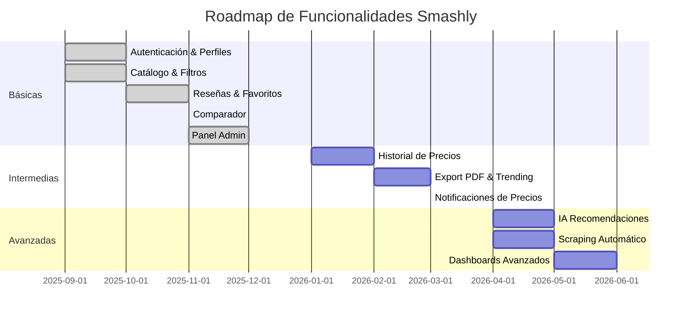

# ⚙️ Funcionalidades del Sistema

Las funcionalidades se clasifican en **Básicas**, **Intermedias** y **Avanzadas**, según el nivel de complejidad y prioridad.

**Estado de implementación:**

- ✅ **Implementado** - Funcionalidad completada en v0.1
- 🚧 **En desarrollo** - Funcionalidad parcialmente implementada
- ⏳ **Pendiente** - Funcionalidad planificada para próximas versiones

---

## 🟢 Funcionalidades Básicas

| Funcionalidad                              | Estado | Usuario no registrado                             | Usuario registrado               | Administrador                         |
| ------------------------------------------ | ------ | ------------------------------------------------- | -------------------------------- | ------------------------------------- |
| **Registro / Login**                       | ✅     | Registrarse, iniciar sesión ~~, recuperar contraseña (a la espera de implementarlo con envío de correo electrónico)~~ | Gestionar su perfil              | Gestión de usuarios (roles, bloqueo)  |
| **Ver catálogo**                           | ✅     | Sí (leer)                                         | Sí (leer)                        | Sí (leer + gestionar visibilidad)     |
| **Ver página detalle**                     | ✅     | Sí (leer)                                         | Sí (leer)                        | Sí (leer + editar metadatos)          |
| **Lista de palas favoritas con etiquetas** | ✅     | —                                                 | Sí (crear/editar/borrar propias) | Ver agregados anonimizados            |
| **Reseñas de usuarios sobre palas**        | ✅     | Leer reseñas públicas                             | Crear/editar/borrar propias      | Moderación (aprobar, ocultar, banear) |
| **Gestión de palas**                       | ✅     | —                                                 | —                                | Alta/edición/borrado de palas         |
| **Gestión de tiendas**                     | ✅     | —                                                 | —                                | Alta/edición/borrado de tiendas       |

**Notas de implementación v0.1:**

- ✅ **Registro/Login**: Sistema completo implementado con autenticación JWT. La recuperación de contraseña está pendiente para v0.2.
- ✅ **Catálogo**: Implementado con búsqueda, filtros avanzados (marca, forma, balance, precio) y paginación.
- ✅ **Página detalle**: Muestra información completa de cada pala, incluyendo características técnicas, precios por tienda, imágenes y reseñas.
- ✅ **Listas de favoritos**: Los usuarios pueden crear múltiples listas personalizadas, añadir/quitar palas y organizarlas con etiquetas.
- ✅ **Reseñas**: Sistema completo de valoraciones (1-5 estrellas) con comentarios, edición y moderación por administradores.
- ✅ **Gestión de palas**: CRUD completo en panel de administración con formularios validados y gestión de imágenes.
- ✅ **Gestión de tiendas**: CRUD completo para administrar las tiendas asociadas a los precios de las palas.

---

## 🟡 Funcionalidades Intermedias

| Funcionalidad                                          | Estado | Usuario no registrado         | Usuario registrado                          | Administrador                          |
| ------------------------------------------------------ | ------ | ----------------------------- | ------------------------------------------- | -------------------------------------- |
| **Comparar palas**                                     | ⏳     | Comparación básica de 2 palas | Comparación completa + guardar comparativas | Definir reglas, fuentes y pesos        |
| **Ver palas *trending***                               | ⏳     | Sí                            | Personalización según actividad             | Configurar algoritmo/triggers          |
| **Descargar comparativa en PDF**                       | ⏳     | —                             | Sus propias comparativas                    | Plantillas/branding global             |
| **Avisos de bajada/subida de precios**                 | ⏳     | —                             | Suscripción por pala/tienda/umbral          | Configurar umbrales globales y cuotas  |
| **Rellenar datos personales para formulario avanzado** | ⏳     | —                             | Guardar perfil de juego y preferencias      | Ver agregados anonimizados             |
| **Formulario "mejor pala" avanzado**                   | ⏳     | Formulario básico             | Versión avanzada con historial              | Definir preguntas, pesos, A/B tests    |
| **Historial de precios por pala (gráfico)**            | ⏳     | Consultar gráfico básico      | Consultar más detalles, exportar datos      | Configurar frecuencia y almacenamiento |
| **Soporte / contacto**                                 | ⏳     | Formulario básico             | Historial de tickets                        | Gestión de soporte                     |

**Notas de implementación v0.1:**

- ✅ **Comparador de palas**: Implementado para comparar 2 palas lado a lado con todas sus características técnicas. Los usuarios registrados pueden guardar comparativas.
- ⏳ **Formulario avanzado**: Implementado formulario básico de recomendación. La versión avanzada con IA y historial está en desarrollo.
- ⏳ **Palas trending**: Planificado para v0.2 con algoritmo basado en vistas, comparaciones y favoritos.
- ⏳ **PDF export**: Planificado para v0.2 con plantillas personalizables.
- ⏳ **Avisos de precios**: Planificado para v0.2 con sistema de notificaciones configurable.
- ⏳ **Historial de precios**: Planificado para v0.2 con gráficos interactivos y exportación de datos.
- ⏳ **Soporte**: Planificado sistema de tickets para v0.2.

---

## 🔴 Funcionalidades Avanzadas

| Funcionalidad                                     | Estado | Usuario no registrado                           | Usuario registrado                                                | Administrador                                  |
| ------------------------------------------------- | ------ | ----------------------------------------------- | ----------------------------------------------------------------- | ---------------------------------------------- |
| **Realizar scraping automático de precios**       | 🚧     | —                                               | —                                                                 | Programar/forzar ejecuciones, logs, reintentos |
| **Recomendar "Próxima pala" en base a la actual** | ⏳     | —                                               | Recomendación personalizada                                       | Ajustar modelos/reglas                         |
| **Panel de estadísticas**                         | ⏳     | —                                               | Consultar sus datos (actividad, favoritos, comparativas)          | Métricas globales, dashboards                  |
| **Sistema de notificaciones (in-app o email)**    | ⏳     | —                                               | Avisos de precios, recordatorios, novedades                       | Configurar plantillas y políticas              |
| **Recomendación de mejor pala mediante IA**       | ⏳     | Formulario básico con recomendaciones generales | Formulario avanzado con recomendaciones precisas y personalizadas | Configurar campos de formularios               |

**Notas de implementación v0.1:**

- ⏳ **Scraping automático**: Implementados scrapers en Python para 5 tiendas. La automatización con cron/scheduler está pendiente para v0.3.
- ⏳ **Panel de estadísticas**: Implementadas estadísticas básicas en panel de administración. Dashboards avanzados y gráficos interactivos planificados para v0.3.
- ⏳ **Recomendación con IA**: Implementado formulario básico con algoritmo de recomendación. Integración con Gemini AI para recomendaciones avanzadas en desarrollo para v0.3.
- ⏳ **Próxima pala**: Planificado para v0.3 con análisis de evolución de nivel y preferencias.
- ⏳ **Notificaciones**: Sistema completo de notificaciones push y email planificado para v0.3.

---

## 🎯 Roadmap de Funcionalidades

---

